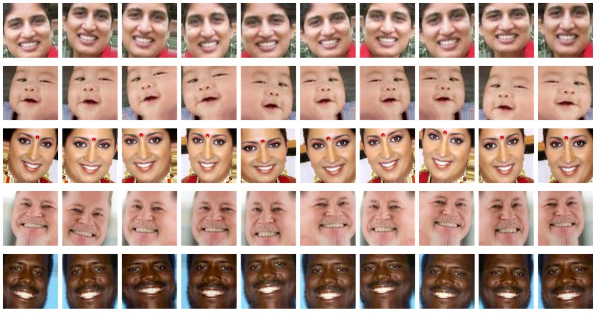
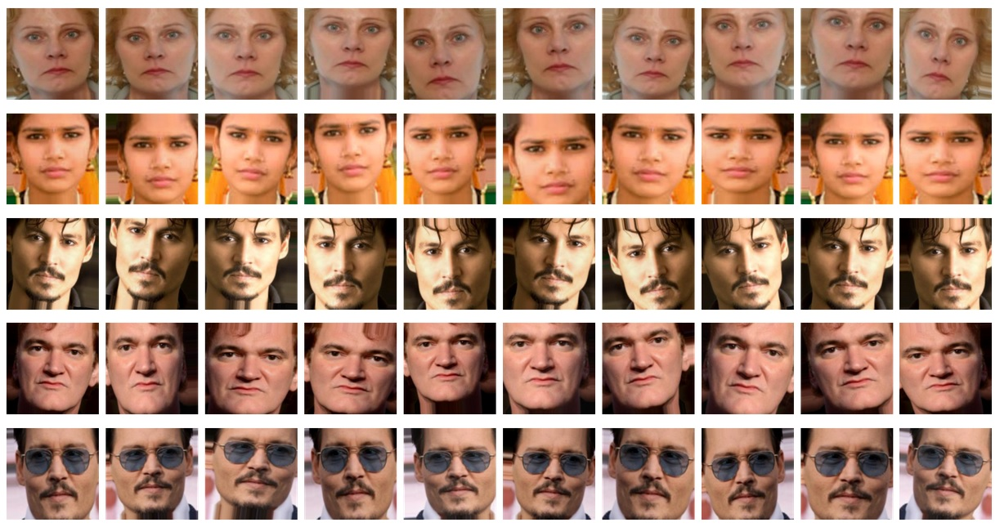
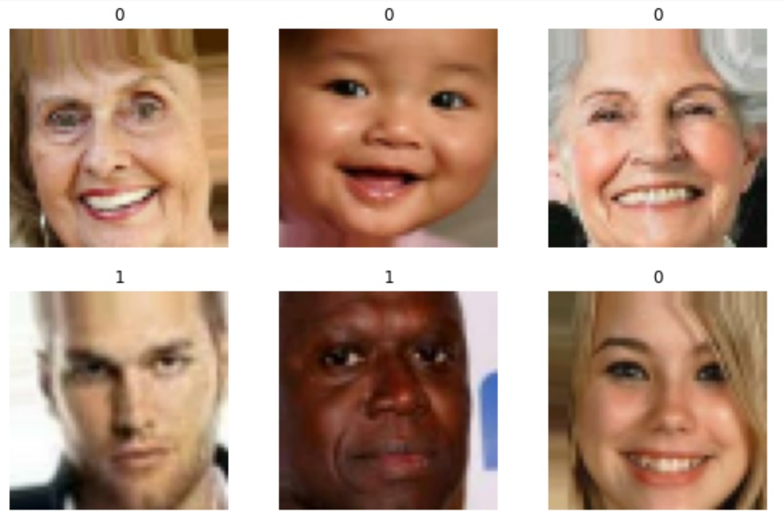
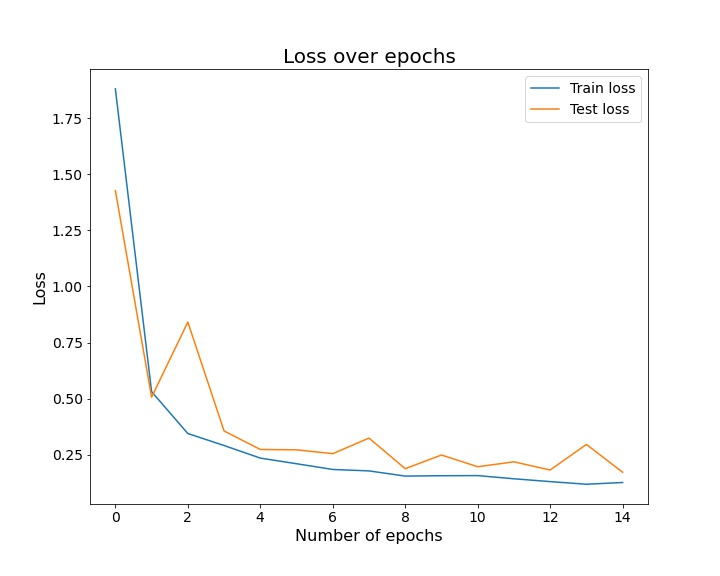
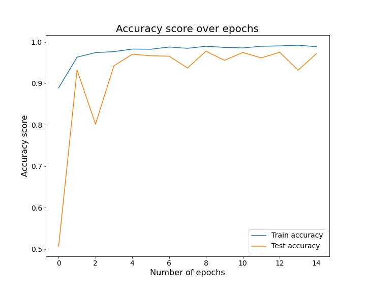
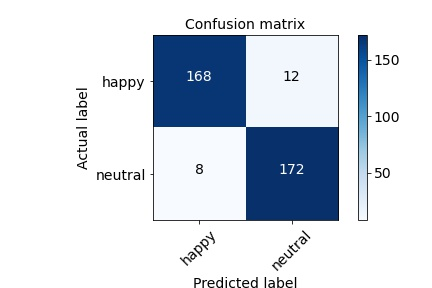

# Emotion detection

Michael Riedeman & Yair Haendler

---

### What's in this repository

|Folder / File|Content|
|---|---|
|Code|Jupyter notebook to prepare the image files (preprocessing); Jupyter notebook to set up and run the model (modelin); a file with useful functions|
|Datasets|Image files for the model|
|Presentation Images|images displayed in this README.md file|
|Saved Models|The best performing model|
|Test|Image files to test the model|
|Emotion Detection with CNNs.pptx|Presentation slides|

---

### Background and Problem Statement

Within Machine Learning, the field of image processing and recognition has gained in recent years much attention and interest. The implications of the ability of a neural network to classify and recognize images of objects, animals, people, places and so on are huge and extensive. It is enough to think, for instance, about a picture application like [Google Photos](https://en.wikipedia.org/wiki/Google_Photos) that recognizes people who have been tagged in the past and sorts them into folders under each person's name, so that all the pictures where that person appears can be browsed in one folder. Another example, with more crucial implications, are systems of [self-driving cars](https://en.wikipedia.org/wiki/Self-driving_car) that are charged with recognizing entities (objects, people, other cars, bicycles, sidewalks, etc.) encountered on the street, based on their images that are taken as input. 

One area that has drawn a lot of attention is **_emotion detection_**. Let us assume we have pictures of different people, some are smiling, some laughing, some with serious facial expression, some angry and some sad. If we could train a neural network to detect some features of the facial expressions in these images, sort them out and eventually classify them as belonging to one of several categories (happy, angry, sad, etc.), we would have a neural network that, in a way, detects the emotional state of a person. 

Such a system might be useful in several areas. Here, we are interested in doing a first step toward building a _rating system_ based on facial expressions. Currently, in order to know whether users approve of the input they are exposed to or not, social media apps and websites rely on users' rating (for example, 'thumbs-up', 'thumbs-down', 'heart', 'laugh', 'angry', 'sad', etc.). The idea is to build a feature that will activate - with user permission and under strict privacy regulations - the phone or computer camera and take a picture of the user's face, in order to derive their reaction to the input from their facial expression. This method has several advantages over the current system of rating from clicks. First, it does not require the user to do anything but to continue watching / reading / hearing the input under consideration without interruption. Second, the 'rating' of a facial expression is much more natural, implicit and automatic than the rating by a click (hence the need for adherence to strict privacy rules and users consent before the feature can be used). Third, the human facial expression is highly complex and subtle, and we can end up having a much more elaborate 'rating scale' that reflects better the human way of reacting to input.

As mentioned, this project is only one small building block towards the development of such a facial expression-based rating system. We will concentrate here only on 2 categories of emotions: **happy** (as expressed by a smile) and **neutral**. Note that within each of these categories, there might be many diverse facial expressions that denote a subtle 'version' of the parent category. For instance, a smile can be with a wide open mouth, with closed lips or just in the eyes. But for the sake of simplicity, we will at this stage concentrate on 'happy' faces and 'neutral' faces in general. 

To this end, we will train a **Convolutional Neural Network** (CNN) on pictures taken from an online database of face images. The images will be divided into 2 classes: faces with a **(1) smily/happy expression** and faces with a **(2) neutral expression**. The CNN's task is to classify newly encountered images as either 'smily/happy' or 'neutral'. 

---

### Data collection

The images on which we trained the CNN were taken from the [UTKFace](https://susanqq.github.io/UTKFace/) open access online database of human faces. The database contains over 20,000 images of people aged 0 to 116, men and women, from different ethnicity groups. 

We extracted from the database 2000 images and divided them into 2 groups: **1000 images of smily/happy faces** and **1000 images of neutral faces**. In each category, we selected a variety of pictures of people with different characteristics:

1. _Age_ (babies, toddlers/children, young adults / adults, elderly); 

2. _Gender_ (women, men); 

3. _Ethnicity_ (white, dark skinned, Asian). 

It is a well known problem that image detection models in the past have failed to recognize non-white individuals. This is likely due to model training mainly on images of white people; thus, when the model encounters an image of a non-white person, it is likely to make errors in recognition. Training the CNN on a variety of people's appearances like in our database should ensure better performance on different types of unseen pictures.

---

### Pre-processing

#### Data augmentation

**Data augmentation** is a process by which we create new images out of the images at our disposal. This is done by taking each image and manipulating it in different ways: *rotating* the image; *shifting* the image vertically or horizontally; *flipping* the image; *zooming* in and out; and so on. This way, we create more data, meaning the model is trained on a much larger amount of images; moreover, the model learns to recognize different instances of images, that might not resemble perfectly the layout and position of the face in the training images. For example, a smiling person whose head faces slightly to the right is still a smiling person, and we want our model to be able to recognize it as such.

To perform data augmentation, we used Keras's [ImageDataGenerator](https://keras.io/api/preprocessing/image/) class. The series of images below show an example of data augmentation for 10 pictures from our data: 5 happy faces and their augmented pictures, and 5 neutral faces and their augmented pictures.

Each original image and an augmentation thereof was given a unique file name and placed in one of 2 folders: **happy** for the smily/happy faces, and **neutral** for the neutral facial expressions.

With the data augmentation process, we ended up having 6,281 happy-face images and 6339 neutral-face images.

We used [Keras Image Data Preprocessing](https://keras.io/api/preprocessing/image/) to extract the images from each folder and assign them to one of two classes: happy (coded as 0) and neutral (coded as 1). The following is an example of how each picture was coded as either 0 or 1 based on whether it was extracted from the 'happy' folder or from the 'neutral' folder, respectively:

The images were processed as colored images, with a size of 56 x 56 inches each.

#### Train-validation split

Out of the 12,620 images, 10,727 were specified as training set (85% of the data) on which the model was trained, and the remaining 1893 images were used as validation data (15% of the data), set aside as new, unseen data with which to test the model performance.

---

### Building the Neural Network

Our CNN was structured as follows: 

1. Entry block with **2 convolutional 2D layers**, both with *L2 kernel regularization*, *Batch Normalization* (a procedure that re-centers and re-scales the input in the layer), and a *Rectified Linear Unit* ('relu') activation function.

2. A second block with 5 **Separable Convolutional 2D layers**, each layer with *L2 depthwise* as well as *pointwise regularization*, *Batch Normalization*, a 'relu' activation function and with *Max Pooling*.

3. **Global Average Pooling** and a **Dropout** of 50%.

4. Dense **output layer** with 1 node and activation function *sigmoid*, which is used for binary classification.

The loss function of the model was specified as *Binary Crossentropy*. We used an *Adam* optimizer with learning rate of 0.001 and monitored the *accuracy* score.

---

### Results

In this problem, the **baseline accuracy score was 50%**, given that we had the exact same number of images from the 'happy' class and from the 'neutral' class. Thus, the first goal for our CNN is to get an accuracy score on the training and validation data that is higher than 0.5.

After several attempts and fine-tunings of various models, the best performing model yielded an accuracy rate of **0.988** on the *training data* and of **0.972** on the *validation data*. Thus, the model performed much better than the baseline score of 0.5. 

However, there were many fluctuations in the loss function reduction and the maximization of the accuracy score in the validation data.

The following plot shows the training vs. the validation loss function reduction in the course of the model's 15 epochs:

The following plot shows the training vs. the validation accuracy score:

Various attempts to fine-tune the model, introducing early stopping, a larger dropout rate, different types of regularization, higher/lower number of epochs - all failed to eliminate completely the big jumps in the loss and accuracy score from one epoch to the next. However, the final model we report has achieved relatively good performance and the fluctuations in its loss-minimization and accuracy-maximization are significantly better than those in previous versions of the model.

--

#### Test data

To further test our model, we set aside as **test data** 360 pictures, 180 with happy faces and 180 with neutral faces. These pictures, that were included neither in the training set nor in the validation set, were annotated with respect to the **age** (baby, child, adult, elderly) and the **race** (dark, asian, white) of the person in the picture. 

The model performed on the test data slightly worse than on the validation data, but still with a high **accuracy** score of **0.94** (and an F1 score of 0.94 as well).

To see the model performance in predicting happy and neutral faces, let us look at the confusion matrix plot:

We see that, overall, the model predicts very well both happy and neutral faces. The errors of the model might be due to subtle facial expressions where it is not completely clear whether the person is smiling with closed lips or whether she has a neutral expression.

Next, let us look at the model accuracy broken down by **race** and by **age group**:

|Race|Mean accurate prediction of _happy_ vs. _neutral_|
|:---:|:---:|
|Dark|0.90|
|Asian|0.95|
|White|0.97|

As can be seen, despite the equal distribution of pictures with persons of different races in the training set, the model still performs worse on dark-skinned individuals than on light-skinned ones, and worse on Asian individuals than on white ones.

|Age group|Mean accurate prediction of _happy_ vs. _neutral_|
|:---:|:---:|
|Babies|0.96|
|Children|0.97|
|Adults|0.99|
|Elderly|0.84|

The lower accuracy on elderly people is perhaps not surprising. It might be that the wrinkles on the face skin make it harder for the model to detect facial expressions like a subtle smile.

---

### Conclusions

In this project, we trained a Convolutional Neural Network (CNN) to recognize images of human faces as either smiling or having a neutral expression. This task could serve as a building block in a larger system that detects human emotional reaction to some input. 

Of course, facial expression is only one source for emotion detection. A system that could integrate input from images of facial expressions as well as of body movement/gestures, voice and so on, should be, at the cost of being a lot more complex than the CNN presented here, also much more accurate.

Possible future steps might include classifying more than 2 classes of emtion, for example, 'happy', 'angry', 'sad' and 'surprised', all types of emotions with relatively clearly visible facial expression. In an additional step, it could also be interesting and important to train a CNN on recognizing and classifying more subtle facial expressions.

More practical questions related specifically to our model are how to achieve a more stable accuracy score on the validation data, and how to eliminate the small overfit of the model (higher accuracy score on the training set than on the validation set). One possibility is to use a pre-trained model, as suggested [here](https://deeplizard.com/learn/video/oDHpqu52soI). This is something that will have to be further deepened.

---